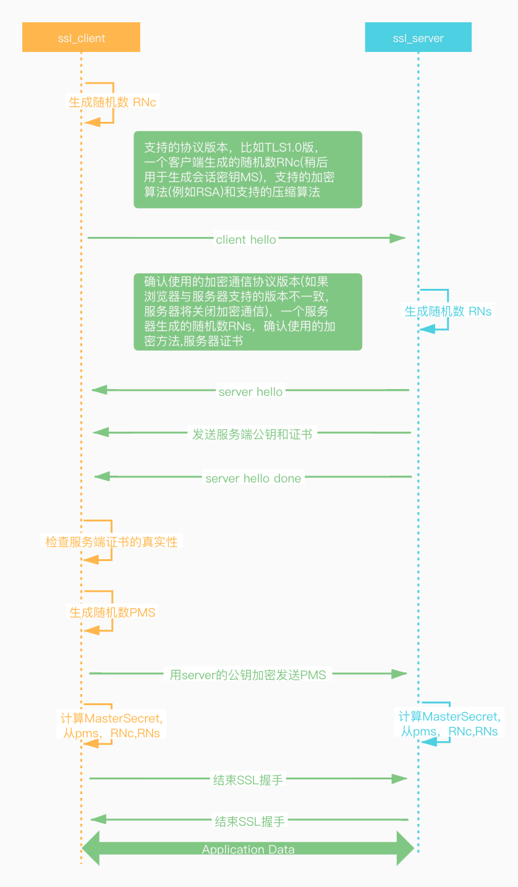

### https完整建立连接过程
- 建立TCP握手连接
- 进行SSL协议的握手密钥交换
- 通过约定密钥进行通信
### SSL/TLS握手过程
-  **`client hello`**: 客户端通过发送"client hello" 消息向服务器发起握手请求，该消息包含了客户端所支持的TLS版本和密码组合以供服务器进行选择，还有一个"RNc"的随机字符串
- **`server hello`**: 服务器发送"server hello"消息对客户端进行响应，该消息包含数字证书，服务器选择的密码组合和"RNs"随机字符串。
- **验证**：客户端对服务器端发来的证书进行验证，确保对方的合法身份，验证过程可以细分为以下几个步骤
  1. 检查数字签名
  2. 验证证书链
  3. 检查证书的有效期
  4.检查证书的撤回状态
- **`pre master secret`字符串**：客户端向服务器发送使用公钥加密的`PMS`
- **解密**：服务器使用私钥解密`PMS`
- **生成共享密钥**：客户端和服务端均使用RNc,RNs和PMS,并使用相同算法生成共享密钥key（Master Secret）
- **客户端就绪**：客户端发送经过共享密钥 KEY加密过的"finished"信号。
- **服务器就绪**：服务器发送经过共享密钥 KEY加密过的"finished"信号。
- **达成安全通信**：握手完成，双方使用对称加密进行安全通信。

