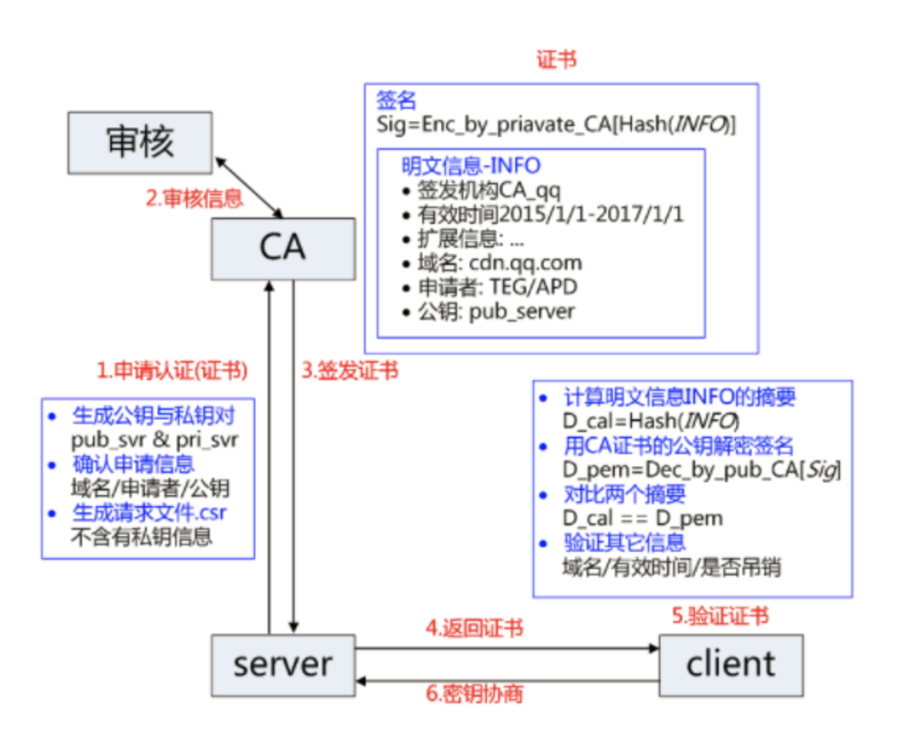

- 服务方 Server 向第三方机构CA提交公钥、组织信息、个人信息(域名)等信息并申请认证;
- CA通过线上、线下等多种手段验证申请者提供信息的真实性，如组织是否存在、企业是否合法，是否拥有域名的所有权等;
- 如信息审核通过，CA会向申请者签发认证文件-证书。证书包含以下信息：申请者公钥、申请者的组织信息和个人信息、签发机构 CA的信息、有效时间、证书序列号等信息的明文，同时包含一个签名; 
签名的产生算法：首先，使用散列函数计算公开的明文信息的信息摘要，然后，采用 CA的私钥对信息摘要进行加密，密文即签名;
- 客户端 Client 向服务器 Server 发出请求时，Server 返回证书文件;
- 客户端 Client 读取证书中的相关的明文信息，采用相同的散列函数计算得到信息摘要，然后，利用对应 CA的公钥解密签名数据，对比证书的信息摘要，如果一致，则可以确认证书的合法性，即公钥合法;
- 客户端还会验证证书相关的域名信息、有效时间等信息; 客户端会内置信任CA的证书信息(包含公钥)，如果CA不被信任，则找不到对应 CA的证书，证书也会被判定非法。

参考连接：
https://segmentfault.com/a/1190000021494676
https://segmentfault.com/a/1190000021559557

参考回答链接：
https://github.com/wangmeijian/blog/blob/master/docs/12.md
